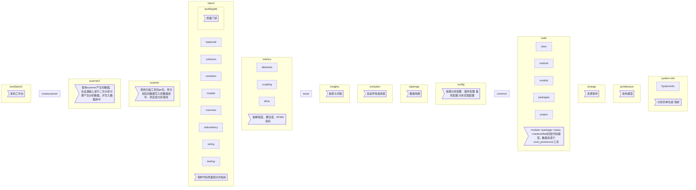

```mermaid
graph

subgraph system-info
	SystemInfo
	system-info-notes>"分析的单位是“系统”"]
end

subgraph architecture
	architecture-notes>"架构模型"]
end


subgraph change
	change-notes>"变更影响"]
end

subgraph code
	clazz
	method
	module
	packages
	project
	code-notes>"module->package->class->method/field四层代码模型，数据来源于scan_javasource工具"]
end


subgraph common
end

subgraph config
	config-notes>"依赖分析配置：插件配置 着色配置 分析范围配置"]
end

subgraph datamap
	datamap-notes>"数据地图"]
end

subgraph evolution
	evolution-notes>"演进坏味道阀值"]
end

subgraph insights
	insights-notes>"趋势与洞察"]
end

subgraph issue
end

subgraph metrics
	abstracts
	coupling
	dfms
	metrics-notes>"抽象程度、耦合度、DFMS指标"]
end

subgraph qualitygate
	qualitygate-notes>"质量门禁"]
end

subgraph report
	badsmell
	cohesion
	container
	models
	overview
	qualitygate
	redundancy
	sizing
	testing
	report-notes>各种代码质量相关的指标]
end

subgraph scanner
	scanner-notes>"调用扫描工具的jar包，将分析后的数据写入到数据库中，供后续分析使用"]
end

subgraph scanner2
	scanner2-notes>"使用scanner产生的数据，在此基础上进行二次分析计算产生分析数据，并写入数据库中"]
end

subgraph smartscanner
end

subgraph workbench
	workbench-notes>"架构工作台"]
end

```

## 词汇表
- System：分析的最小单位
- ArchSystem：架构承载体
- SystemInfo：系统扫描分析配置信息

