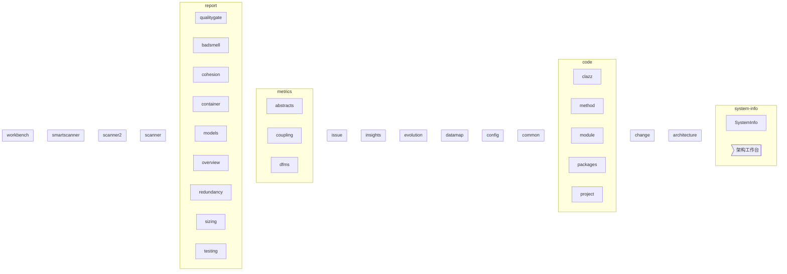

```mermaid
graph

subgraph system-info
	SystemInfo
	notes>"分析的单位是“系统”"]
end

subgraph architecture
	notes>"架构模型"]
end


subgraph change
	notes>"变更影响"]
end

subgraph code
	clazz
	method
	module
	packages
	project
	notes>"module->package->class->method/field四层代码模型，数据来源于scan_javasource工具"]
end


subgraph common
end

subgraph config
	notes>"依赖分析配置：插件配置 着色配置 分析范围配置"]
end

subgraph datamap
	notes>"数据地图"]
end

subgraph evolution
	notes>"演进坏味道阀值"]
end

subgraph insights
	notes>"趋势与洞察"]
end

subgraph issue
end

subgraph metrics
	abstracts
	coupling
	dfms
	notes>"抽象程度、耦合度、DFMS指标"]
end

subgraph qualitygate
	notes>"质量门禁"]
end

subgraph report
	badsmell
	cohesion
	container
	models
	overview
	qualitygate
	redundancy
	sizing
	testing
	notes>各种代码质量相关的指标]
end

subgraph scanner
	notes>"调用扫描工具的jar包，将分析后的数据写入到数据库中，供后续分析使用"]
end

subgraph scanner2
	notes>"使用scanner产生的数据，在此基础上进行二次分析计算产生分析数据，并写入数据库中"]
end

subgraph smartscanner
end

subgraph workbench
	notes>"架构工作台"]
end

```