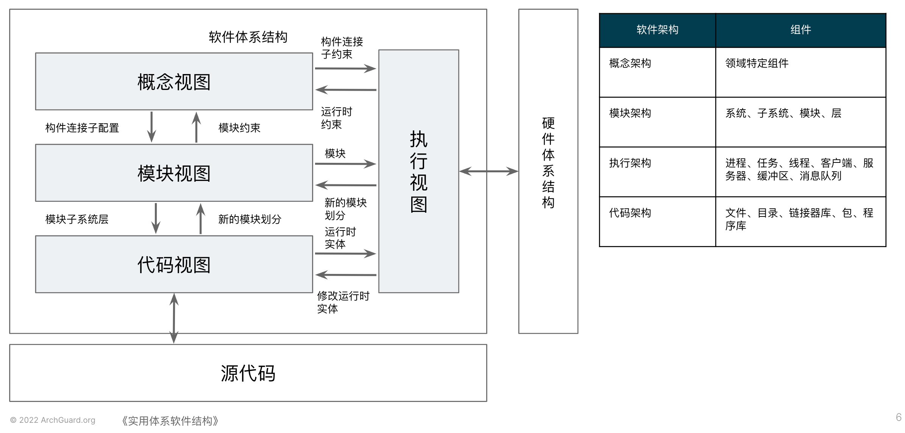
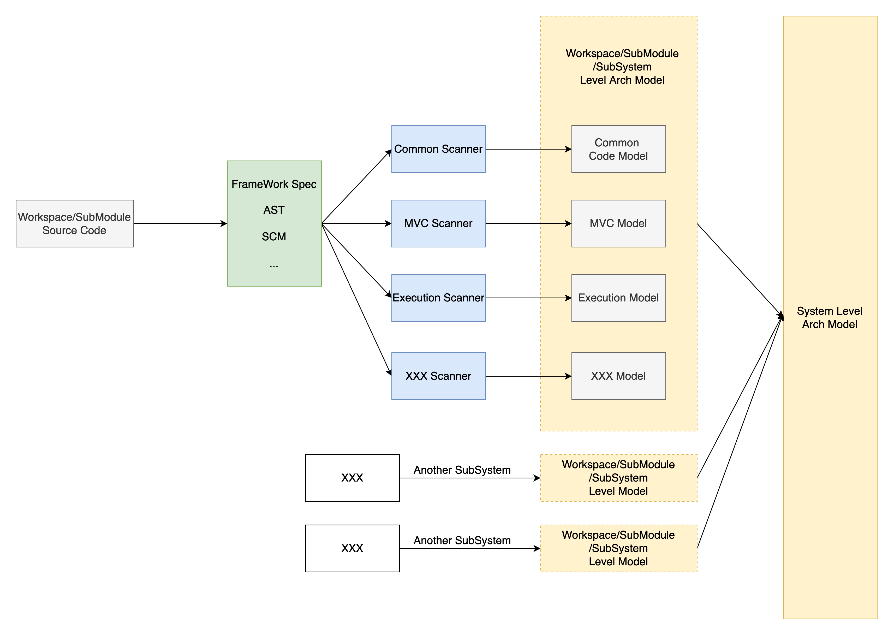
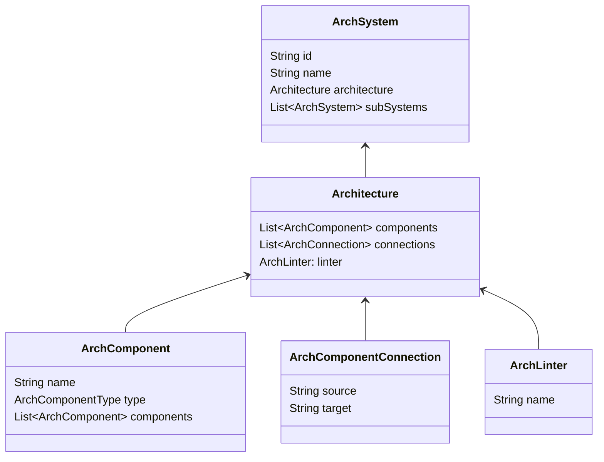
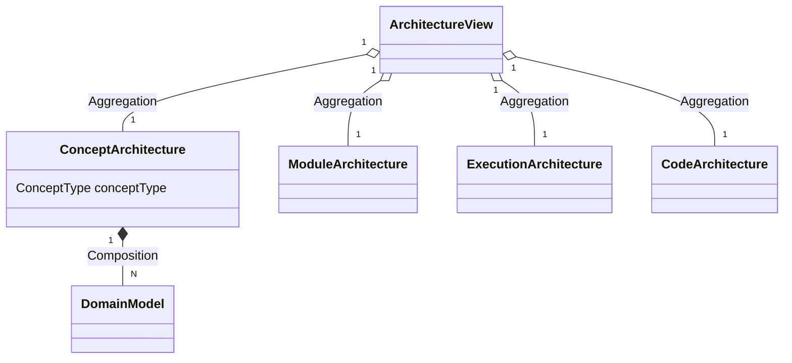
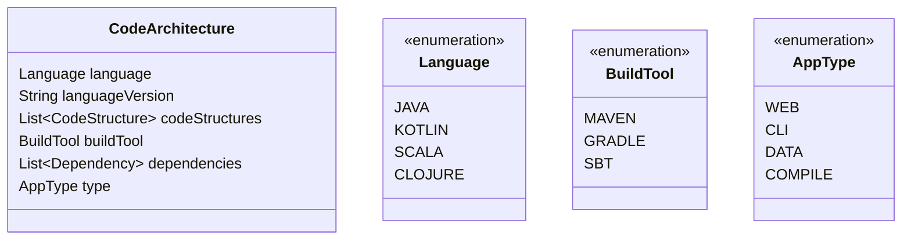
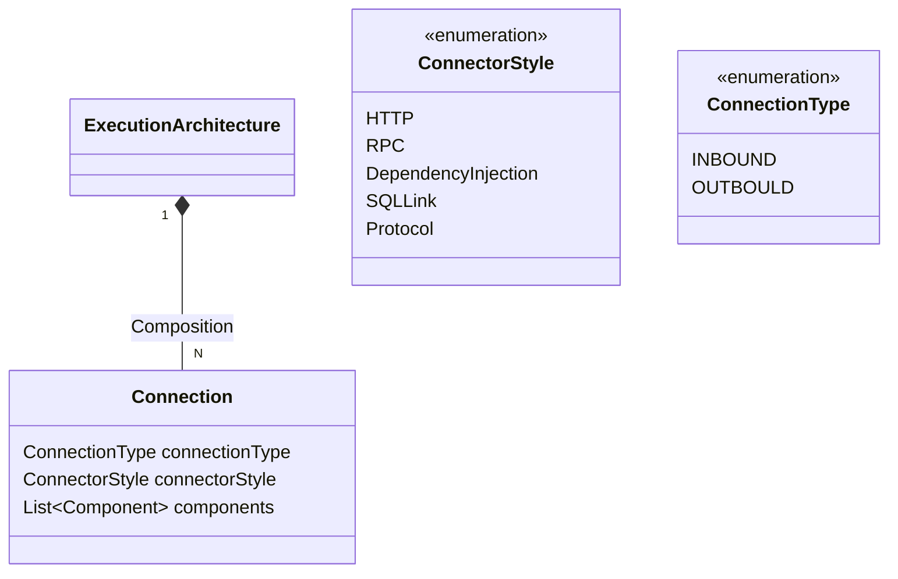
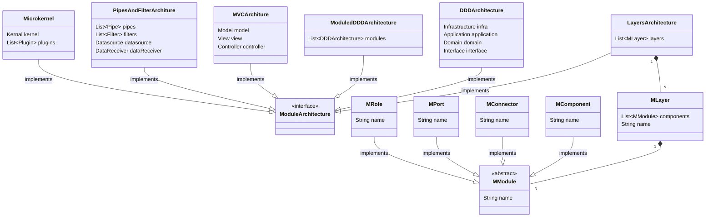

# 架构视图

## 概念体系架构视图

概念体系架构视图与**应用领域**紧密关联。

> 在概念视图中，我们使用“**构件/连接子**”模型来建模。
>
> ### 构件
>
> 构件是独立执行的对等实体，是主要**应用功能**的载体。构件通过端口与外界交互。大多数构件源自需求及应用领域，其他构件可能在支持全局性质时出现。
>
> ### 连接子
>
> **构件通信和控制**由**连接子**来完成，连接子关注控制方面。
>
> [ASA]

### 领域模型

概念视图关注系统的领域模型，具体体现为系统（子系统）对应的聚合、实体、值对象等领域模型。可以通过UML类图的方式来展示领域模型的结构。

## 模块体系结构视图

> 在模块视图中，所有的**应用功能、控制功能、适应和调节**（对应概念视图中的**构件/连接子**）都要映射到模块。
>
> 模块有两个正交的结构：**分解与层**。系统的分解捕获了系统如何在逻辑上被分解成子系统和模块。模块还会被分配到某一特定的层，该层限制了这一模块与其他模块之间的依赖关系。
>
> ### 模块
>
> 一个模块相当于一个单独的概念元素（构件、端口、连接子或者角色），或者是概念元素的集合。
>
> 模块之间的交互通过接口来进行。
>
> ### 层
>
> 模块会被分配到某一特定的层，层限制了模块间的依赖关系。
>
> [ASA]

如何划分和组织模块往往体现了架构的模式。常见的架构模式有：

- 分层架构
- 管道架构
- 微内核架构
- MVC
- DDD/ModuledDDD
- 微服务架构
- ...

不同的架构模式有着不同的模块划分和组织的方式，可以通过模块体系结构视图表现出来。

## 执行体系结构视图

> 执行视图依据**系统运行时**的平台元素(Plantform Element)来描述系统的结构。包括：操作系统任务、进程、线程、地址空间等。
>
> [ASA]

在系统运行中，不同模块或子系统之间的连接可以被建模成Connection的形式，常见的连接方式有Http, RPC, 依赖注入,共享内存等等。

## 代码体系结构视图

> 代码体系视图与编程语言的具体实现紧密相关。
>
> **源代码构件、中间构件，部署构件**映射到**模块视图和执行视图**中的元素。
>
> [ASA]

代码视图与一个SubModule或者Workspace中的代码实现紧密关联，模块，包，文件的树状组织结构，构建工具，依赖库，AST，打包和部署的形式等都属于代码视图的模型。

## 模式划分原则

> 模式的名称大都基于某一种特定实现之上，但在实践中的运用并不一定完全相同。只要具备了某模式的一些关键特征，我们就可以认为遵循了该模式。
>
> [POSA4]

## Archguard模型的流动与实现

##  Archguard系统级别的架构视图模型实现（演进中）

## Archguard子系统(Workspace/Module)级别的架构视图模型实现（演进中）

V0.2:

 - 全局视图 and 概念视图

 - 代码视图

 - 执行视图

 - 模块视图

## 参考资料

- 《实用体系软件结构》[ASA]
- 《面向模式的软件架构 卷1:模式系统》[POSA1]
- 《面向模式的软件架构 卷4:分布式计算的模式语言》[POSA4]
- 《软件架构：架构模式、特征及实践指南》
