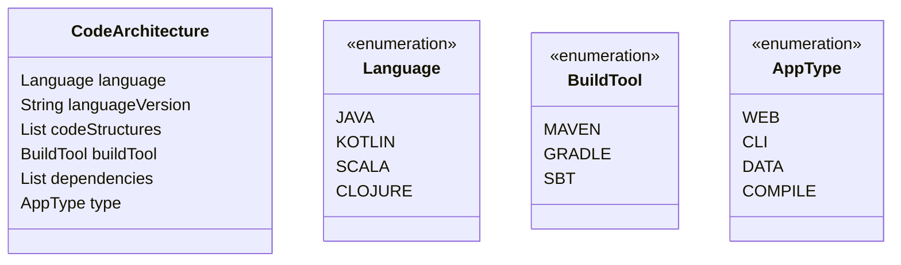
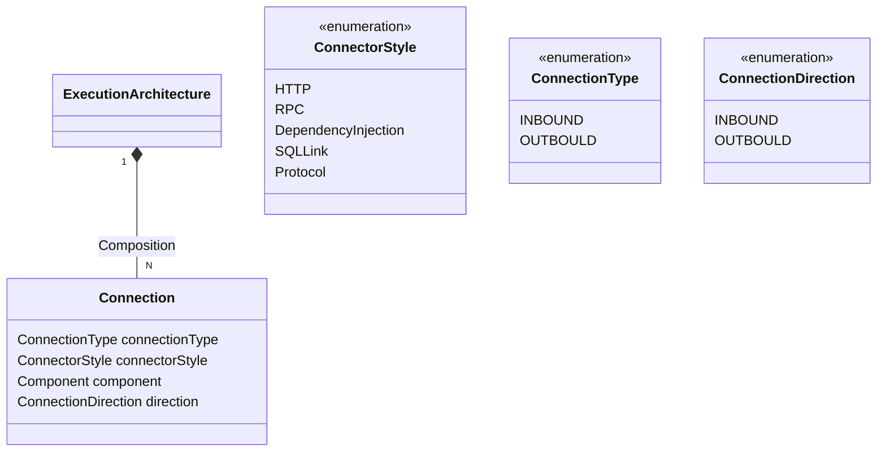
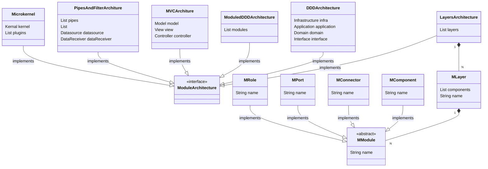

# 架构视图

## 概念体系架构视图

概念体系架构视图与**应用领域**紧密关联。

在概念视图中，我们使用“**构件/连接子**”模型来建模。

### 构件

构件是独立执行的对等实体，是主要**应用功能**的载体。构件通过端口与外界交互。大多数构件源自需求及应用领域，其他构件可能在支持全局性质时出现。

### 连接子

**构件通信和控制**由**连接子**来完成，连接子关注控制方面。

## 模块体系结构视图

在模块视图中，所有的**应用功能、控制功能、适应和调节**（对应概念视图中的**构件/连接子**）都要映射到模块。

模块有两个正交的结构：**分解与层**。系统的分解捕获了系统如何在逻辑上被分解成子系统和模块。模块还会被分配到某一特定的层，该层限制了这一模块与其他模块之间的依赖关系。

### 模块

一个模块相当于一个单独的概念元素（构件、端口、连接子或者角色），或者是概念元素的集合。

模块之间的交互通过接口来进行。

### 层

模块会被分配到某一特定的层，层限制了模块间的依赖关系。

## 执行体系结构视图

执行视图依据**系统运行时**的平台元素(Plantform Element)来描述系统的结构。包括：操作系统任务、进程、线程、地址空间等。

## 代码体系结构视图

代码体系视图与编程语言的具体实现紧密相关。

**源代码构件、中间构件，部署构件**映射到**模块视图和执行视图**中的元素。

##  Archguard系统级别的架构视图模型实现

TODO

## Archguard子系统(Workspace/Module)级别的架构视图模型实现

V0.2:

 - 全局视图 and 概念视图

 - 代码视图

 - 执行视图

 - 模块视图

----------------------

**Comment**

- 概念视图 展示 domain object uml视角
- 模块视图 不同架构模型的模块展示
- 执行视图 架构的端口 内向 外向
- 代码视图 整个项目的代码结构

## 参考资料

- 《实用体系软件结构》