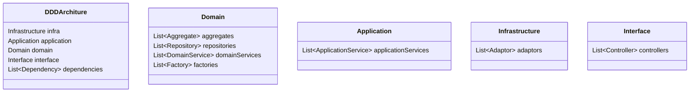

# 模块体系结构视图模型（演进中）

模型实现见：https://github.com/archguard/scanner/tree/master/analyser_architecture/src/main/kotlin/org/archguard/architecture/core/module/view/module

## Model-View-Controller

> Model-View-Controller的实现方式将不同变化率的应用职责分离开，从而支持它们独立地改进。
>
> Model定义了应用的功能核心。通常Model被划分为一个或多个应用Domain Object，每个Domain Object负责一个自我完备的职责。
>
> 应用用户界面所展现的信息数据都封装在一个自我完备的View中，包括从Model中获取相关数据的功能、将数据转换成输出格式以及在用户界面中显示输出等。
>
> 系统中的每个View都与一个以上的Controller相关联以更新Model的状态。
>
> [POSA4]

## DDD

> 接入层负责的是系统的输入和输出。
>
> 应用层，组织业务场景，编排业务，隔离场景对领域层的差异。
>
> 领域层，实现具体的业务逻辑、规则，为应用层提供无差别的服务能力。
>
> 基础设施层，提供具体的技术实现，比如存储，基础设施对业务保持透明。
>
> 
>
> 领域（Domain）是业务相关知识的集合。领域模型（Model）是业务概念在程序中的一种表达方式。
>
> 聚合（Aggregate）是一组生命周期强一致，修改规则强关联的实体和值对象的集合，表达统一的业务意义。
>
> 仓储（Repository）是以持久化领域模型为职责的类。
>
> 服务（Service）是领域模型的操作者，负责领域内的业务规则的实现。
>
> 工厂（Factory）是以构建领域模型（实体或值对象）为职责的类或方法。
>
> [domain-driven-design.org]

## ModuledDDD

## 分层架构

## 管道架构

## 微内核架构

## 微服务架构

## 参考资料

- 《面向模式的软件架构 卷4:分布式计算的模式语言》[POSA4]
- https://domain-driven-design.org/zh/ddd-concept-reference.html [domain-driven-design.org]